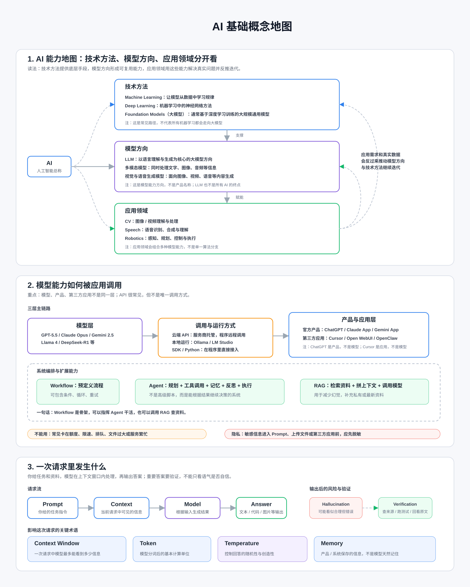

# AI 基础知识

## 0. 关系思维导图



## 0.1 术语速查表

| 术语 | 一句话速查 |
| --- | --- |
| AI | 人工智能，让机器完成理解、生成、判断、规划等任务的技术总称。 |
| ML | 机器学习，让模型从数据中学习规律，而不是靠人手写死规则。 |
| DL | 深度学习，基于多层神经网络，擅长处理语言、图像、语音等复杂信息。 |
| LLM | 大语言模型，专门处理和生成语言内容的 AI 模型，但不等于事实库。 |
| Prompt | 给模型的任务指令，包括目标、背景、输入、限制和输出格式。 |
| Context | 模型当前能看到的信息范围，包括本轮输入、历史对话、文件内容等。 |
| Token | 模型处理文本的基本单位，输入和输出都会消耗 token。 |
| API | 程序调用模型能力的接口，让软件可以自动使用 AI。 |
| API Key | 调用 API 的身份凭证，用来证明是谁在使用服务。 |
| Context Window | 模型一次请求最多能处理的 token 数，也就是最大上下文长度。 |
| Temperature | 控制模型输出随机性和发散程度的参数。 |
| Rate Limit | 服务对请求频率的限制，防止短时间调用过多。 |
| Quota | 账号或服务可用的额度，例如消息次数、token 数、调用次数。 |
| Multimodal | 多模态，指模型能处理文本、图片、音频、视频等多种信息。 |
| Memory | 产品保存的用户偏好或长期信息，不等于完整保存所有聊天。 |
| Local Model | 在本地电脑或服务器运行的模型，不完全依赖云端服务。 |
| Workflow | 固定的一组 AI 使用步骤，用来稳定完成一类任务。 |
| Verification | 对 AI 输出进行事实、代码、计算或来源验证。 |
| Inference | 使用训练好的模型生成结果的过程。 |
| Training | 通过大量数据调整模型参数，让模型学会规律。 |
| Fine-tuning | 在已有模型基础上，用特定数据继续训练，让它更适合某类任务。 |
| RAG | 检索增强生成，先从资料库找相关内容，再让模型基于资料回答。 |
| Embedding | 把文本、图片等内容转换成向量，用于相似度搜索和匹配。 |
| Hallucination | 模型生成看似合理但实际错误或不存在的信息。 |
| Agent | 能调用工具、执行步骤、观察结果并继续行动的 AI 系统。 |

## 0.2 常见问题速查表

| 问题 | 一句话速查 |
| --- | --- |
| 网页版、订阅版、API 是什么关系 | 网页版适合手动使用，订阅版通常给个人更多额度或功能，API 给程序调用且通常单独计费。 |
| 为什么 AI 有时突然不能用了 | 常见原因是额度用完、请求过快、模型排队、文件过大或服务繁忙。 |
| 为什么 AI 会胡说 | 模型会根据上下文生成最可能的内容，信息不足时可能生成错误但看似合理的答案。 |
| Prompt 怎么写才稳 | 说清目标、背景、输入、限制和输出格式。 |
| 为什么要追问 | 第一次输出通常是草稿，追问可以补充约束、修正方向、降低误解。 |
| 上传文件要注意什么 | 注意文件过大、解析不完整、扫描件识别错误、表格错列和隐私信息。 |
| AI 写代码为什么不稳 | 模型可能不了解完整项目、依赖版本、运行环境或旧 API 差异。 |
| AI 总结为什么会漏重点 | 总结会压缩信息，可能丢失条件、例外、数字和原文语气。 |
| 隐私能不能发给 AI | 敏感信息不应直接输入第三方 AI，必要时应脱敏或使用可信环境。 |
| 成本为什么会变高 | 成本通常和输入长度、输出长度、调用次数、模型价格和上下文大小有关。 |
| 本地模型适合什么时候用 | 适合隐私敏感、离线使用、学习实验或成本可控的场景，但需要硬件和维护。 |

## 1. 常用术语

### 1. AI

基础含义：人工智能，总称，指让机器完成理解、生成、判断、规划等任务的技术。

故事理解：像公司新来的万能实习生，会整理资料、写草稿、看图片、帮你想方案；但重要决定还得你审核。

### 2. ML

基础含义：机器学习，让模型从数据中学习规律，而不是靠人手写死规则。

故事理解：像教新人分辨好坏产品，不是一条条背规则，而是看很多真实案例，慢慢学会判断。

### 3. DL

基础含义：深度学习，基于多层神经网络的机器学习方法，擅长处理语言、图像、语音等复杂信息。

故事理解：像经验很丰富的老师傅，能从一堆细节里看出门道，比如从照片、声音、文字里抓重点。

### 4. LLM

基础含义：大语言模型，专门处理和生成语言内容的 AI 模型。

故事理解：像读过很多资料的写作搭子，你给它前文，它会接着写、解释、总结；但它不等于事实库。

### 5. Prompt

基础含义：给模型的任务指令，包括目标、背景、输入、限制和输出格式。

故事理解：像给同事派活。只说“帮我看看”很容易跑偏；说清楚“检查什么、怎么交付”，结果才稳。

### 6. Context

基础含义：模型当前能看到的信息范围，包括本轮输入、历史对话、文件内容等。

故事理解：像会议桌上摊开的材料。桌上有的它能参考，没放上来的资料它就不知道。

### 7. Token

基础含义：模型处理文本的基本单位，输入和输出都会消耗 token。

故事理解：像复印店按页收费。你给 AI 的材料越长、它回答越长，用掉的“页数”就越多。

### 8. API

基础含义：程序调用模型能力的接口，让软件可以自动使用 AI。

故事理解：网页版像你亲自去窗口办事；API 像给自己的系统开了一个窗口，让程序自己去办。

### 9. API Key

基础含义：调用 API 的身份凭证，用来证明是谁在使用服务。

故事理解：像办公室门禁卡。丢了别人可能刷你的卡进门，还把账记到你头上。

### 10. Context Window

基础含义：模型一次请求最多能处理的 token 数，也就是最大上下文长度。

故事理解：像桌子大小。小桌子只能放几页纸，大桌子才能摊开合同、图纸、聊天记录一起看。

### 11. Temperature

基础含义：控制模型输出随机性和发散程度的参数。

故事理解：像咖啡机的口味旋钮。低一点更稳定，适合代码和事实；高一点更发散，适合创意。

### 12. Rate Limit

基础含义：服务对请求频率的限制，防止短时间调用过多。

故事理解：像地铁闸机限流。人太多时不是不能进，而是要分批进。

### 13. Quota

基础含义：账号或服务可用的额度，例如消息次数、token 数、调用次数。

故事理解：像饭卡余额。今天刷完了，就要等刷新或充值。

### 14. Multimodal

基础含义：多模态，指模型能处理文本、图片、音频、视频等多种信息。

故事理解：像同事不只会读邮件，还能看照片、听录音、读表格，沟通方式更多。

### 15. Memory

基础含义：产品保存的用户偏好或长期信息，不等于完整保存所有聊天。

故事理解：像助理记得你喜欢简洁回答，但不会自动记住你上个月每句话。

### 16. Local Model

基础含义：在本地电脑或服务器运行的模型，不完全依赖云端服务。

故事理解：像在家自己做饭。食材和做法都在自己厨房里，秘方更放心不被泄露，但买菜、洗碗、维护厨具都要自己负责。

### 17. Workflow

基础含义：固定的一组 AI 使用步骤，用来稳定完成一类任务。

故事理解：像做菜菜谱。每次都按“输入材料、处理、检查、输出”走，结果更稳定。

### 18. Verification

基础含义：对 AI 输出进行事实、代码、计算或来源验证。

故事理解：像收快递要验货。AI 给了答案，不代表你可以不看说明书、不跑测试。

### 19. Inference

基础含义：使用训练好的模型生成结果的过程。

故事理解：像学生已经学完课，现在现场答题。你提问，它当场作答。

### 20. Training

基础含义：通过大量数据调整模型参数，让模型学会规律。

故事理解：像新人入职培训，看案例、做练习、被纠错，慢慢形成判断能力。

### 21. Fine-tuning

基础含义：在已有模型基础上，用特定数据继续训练，让它更适合某类任务。

故事理解：像通才员工再去补一门专业课，比如专门学习你公司的产品手册。

### 22. RAG

基础含义：检索增强生成，先从资料库找相关内容，再让模型基于资料回答。

故事理解：像开卷考试。先翻书找到相关段落，再组织答案，比凭记忆瞎猜可靠。

### 23. Embedding

基础含义：把文本、图片等内容转换成向量，用于相似度搜索和匹配。

故事理解：像给每段资料在地图上打点。意思相近的资料，地图位置也更近。

### 24. Hallucination

基础含义：模型生成看似合理但实际错误或不存在的信息。

故事理解：像同事没查资料却很自信地报了一个数字，语气很稳，但数字可能是编的。

### 25. Agent

基础含义：能调用工具、执行步骤、观察结果并继续行动的 AI 系统。

故事理解：普通聊天像顾问只给建议；Agent 像助理会查资料、改文件、跑测试，再回来汇报。


## 2. 常见问题

### 1. 网页版、订阅版、API 是什么关系

基础解释：网页版适合手动使用；订阅版通常给个人更多额度或功能；API 给程序调用，通常单独计费。

故事理解：去店里点餐是网页版，办会员是订阅版，把厨房接进自己系统是 API。买了会员，不等于厨房免费给你程序用。

### 2. 为什么 AI 有时突然不能用了

基础解释：常见原因是额度用完、请求过快、模型排队、文件过大或服务繁忙。

故事理解：像外卖高峰期。不是店关门了，可能是饭卡没钱、下单太频繁、骑手排队或订单太大。

### 3. 为什么 AI 会胡说

基础解释：模型会根据上下文生成最可能的内容；当信息不足时，可能生成错误但看似合理的答案。

故事理解：像会议上有人没看资料，但为了接上话，硬把故事补完整。听起来顺，事实未必对。

### 4. Prompt 怎么写才稳

基础解释：Prompt 要说清目标、背景、输入、限制和输出格式。

故事理解：给同事派活时，“帮我看看”很模糊；“找 3 个 bug，按严重程度排序，给修改建议”就清楚多了。

```text
目标：
背景：
输入：
限制：
输出：
```

### 5. 为什么要追问

基础解释：AI 第一次输出通常是草稿，追问可以补充约束、修正方向、降低误解。

故事理解：像改 PPT。第一版先搭框架，第二版改重点，第三版压字数，最后才像能交的版本。

### 6. 上传文件要注意什么

基础解释：文件可能过大、解析不完整、扫描件识别错误、表格错列，也可能包含隐私信息。

故事理解：像把一摞资料放给助理。纸太多会看漏，复印件太糊会看错，夹了银行卡账单还会有隐私风险。

### 7. AI 写代码为什么不稳

基础解释：模型可能不了解你的完整项目、依赖版本、运行环境或旧 API 差异。

故事理解：像厨师只看到菜谱，没看到你厨房缺锅、煤气没开、调料过期。所以代码要小步改、小步跑。

### 8. AI 总结为什么会漏重点

基础解释：总结会压缩信息，可能丢失条件、例外、数字和原文语气。

故事理解：像收行李箱。为了塞进去，厚外套留下了，充电器却可能被忘掉。重要摘要要回看原文。

### 9. 隐私能不能发给 AI

基础解释：敏感信息不应直接输入第三方 AI；必要时应脱敏或使用可信环境。

故事理解：把 AI 当外包同事。能不发身份证、密码、合同原件，就别发；真要发，也先把名字电话密钥涂黑。

### 10. 成本为什么会变高

基础解释：AI 成本通常和输入长度、输出长度、调用次数、模型价格和上下文大小有关。

故事理解：像打印店收费。材料越厚、打印越多、纸越贵，账单越高；少传废话就是少打印。

### 11. 本地模型适合什么时候用

基础解释：本地模型适合隐私敏感、离线使用、学习实验或成本可控的场景，但需要硬件和维护。

故事理解：像自己家里做饭。隐私、安全、长期成本可控，但买菜、洗碗、维护厨房都归你。
